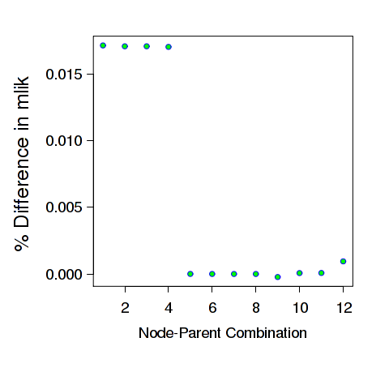
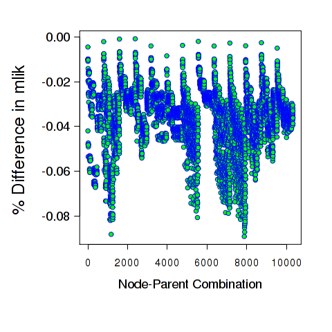
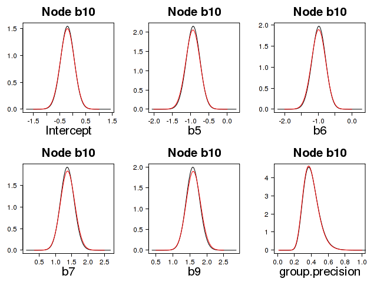
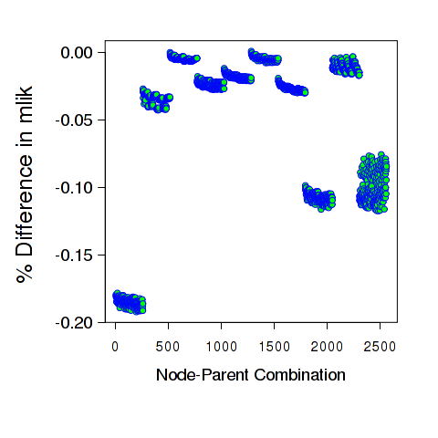
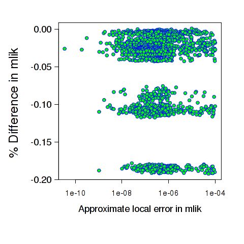
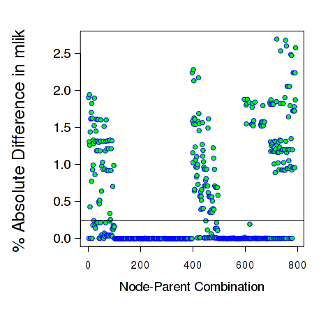
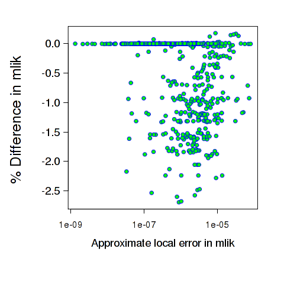
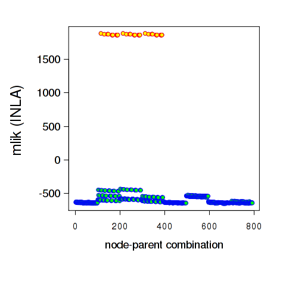
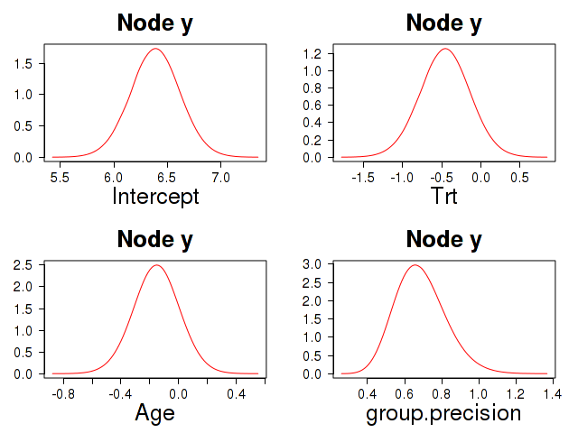
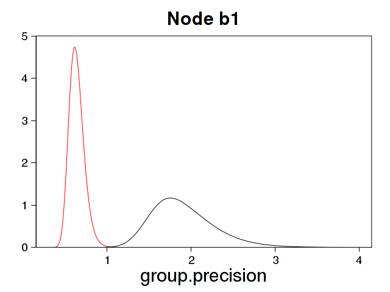

# Introduction

Here we present ten case study analyses which are used to validate the robustness and accuracy of the implementation of the numerical methods used in [abn](https://CRAN.R-project.org/package=abn). In each case real data are utilized comprising of extracts sourced from (published and unpublished) research studies in medicine and biology, as opposed to simulated data, although all variable names have been anonymized. In an attempt to avoid re-inventing the wheel, [abn](https://CRAN.R-project.org/package=abn) has wrappers to allow [INLA](http://www.r-inla.org/) to be used for model fitting. In addition [abn](https://CRAN.R-project.org/package=abn) has its own internal numerical routines, because as we demonstrate across the ten case studies below, for some data sets and models (node-parent combinations) [INLA](http://www.r-inla.org/) does not perform at all well and so an alternative is essential when performing structure discovery.

While the focus of [abn](https://CRAN.R-project.org/package=abn) is on structure discovery i.e. identifying optimal DAGs amongst the vast number of different possible DAG structures, it is obviously first essential to estimate a reliable goodness of fit metric for each candidate DAG. For this we use the standard metric in the Bayesian network literature, the log marginal likelihood (mlik), where this is estimated via Laplace approximations (e.g. [Journal of the American Statistical Association](https://amstat.tandfonline.com/doi/abs/10.1080/01621459.1986.10478240#.XA4ZhRNKi1s)).

The core feature of the [abn](https://CRAN.R-project.org/package=abn) R library is that it should be able to provide robust model comparison of DAGs comprising of nodes which are parametrized as generalized linear models (glm) or generalized linear mixed models (glmm) . Based on results from the following case studies the default setting in [abn](https://CRAN.R-project.org/package=abn) is to use internal [abn](https://CRAN.R-project.org/package=abn) code for glm nodes. There is no obvious speed advantage here in using calls to [INLA](http://www.r-inla.org/), indeed the reverse is true in a number of cases, and the internal code seems more robust for the types of models implemented in [abn](https://CRAN.R-project.org/package=abn). For glmm nodes the default is to use [INLA](http://www.r-inla.org/), as it is very considerably faster than the internal code, however, [INLA](http://www.r-inla.org/)’s results appear unreliable for a considerable minority of the modelling results examined in the following case studies. For this reason results from [INLA](http://www.r-inla.org/) are only used if its estimated parameter modes are sufficiently similar to those from internal code (which are fast and easy to estimate). If this “validity check” fails then internal code is used instead. The choice of internal or [INLA](http://www.r-inla.org/) can be set by the user.

In the following case studies, mlik values and parameter estimates are compared between the internal [abn](https://CRAN.R-project.org/package=abn) code and those from [INLA](http://www.r-inla.org/). Also utilized are established (non-Bayesian) model fitting routines in R, such as *glm()* and *glmer()*, where the latter is from the [lme4](https://CRAN.R-project.org/package=lme4) extension library. The point estimates (modes) from *glm()* and *glmer()* here serve as gold standard estimates of the modes used in the Laplace approximation for the Bayesian models with highly diffuse priors.

___

# QA Case Studies for GLM Nodes

**QA Study One – glm nodes**

This study involves analyses of data set *ex2.dag.data* (provided with abn) and we estimate log marginal likelihoods (mlik) for 18 nodes (variables) allowing at most two parents per node in the DAG. This requires estimating mlik values across 2772 different glm nodes comprising (assumed) Gaussian, binary and Poisson distributed variables. We compare the estimated values for mlik between the internal abn code and INLA. As we do not have a gold standard against which to check the mlik values, we compare the estimated parameter modes against R’s *glm()* function.

The data, results and R code used to run this study can be found [here](source/Rcode/QA_glm_case1.tar.gz). Fig.1 shows that while there is generally excellent agreement between the abn internal code and INLA there are 45 of the 2772 mlik values which are really quite different.


*Figure 1*

For the 45 mlik values whose relative (absolute) difference between abn and INLA was at least 1% we then fitted these nodes individually, and for each compared the parameter modes with output from glm(). Some of these results are given below.

```r

################ bad= 1 ###################

# 1. glm()
(Intercept) p5
3.1045344 0.5277181

# 2. C
b1|(Intercept) b1|p5
3.1045205 0.5277251

# 3. INLA
b1|(Intercept) b1|p5
1.952409008 0.001948155

###########################################
################ bad= 2 ###################

# 1. glm()
(Intercept) p1 p5
3.1657652 -0.1492764 0.5483882

# 2. C
b1|(Intercept) b1|p1 b1|p5
3.1657479 -0.1492691 0.5483910

# 3. INLA
b1|(Intercept) b1|p1 b1|p5
1.9519098549 0.0007641673 0.0019274231

###########################################
....
################ bad= 45 ##################

# 1. glm()
(Intercept) p5 p6
0.89968810 0.06765933 -0.01727257

# 2. C
b6|(Intercept) b6|p5 b6|p6
0.89968746 0.06765934 -0.01727251

# 3. INLA
b6|(Intercept) b6|p5 b6|p6
0.922178660 0.012382561 -0.004336884

############################################

```

In each and every of the 45 cases where the error was “large”, the modes estimated from INLA output were radically different from those produced by glm(). In contrast, the abn internal code gave a very close match to glm() in each and every case. When the modes from INLA were similar to *glm()* then the mlik values were virtually identical. This suggests that the internal code is robust in this example.

___

**QA Study Two – glm nodes**

This study involves analyses of data set ex5.dag.data which is provided with abn and we estimate log marginal likelihoods (mlik) for 18 nodes (variables) allowing at most four parents per node in the DAG. This requires estimating mlik values across 56458 different glm nodes comprising (assumed) Gaussian, and binary distributed variables.

The data, results and R code used to run this study can be found [here](source/Rcode/QA_glm_case2.tar.gz). Fig. 2 shows that while there is generally excellent agreement between abn internal code and INLA there are some 363 of the 56458 mlik values which are very different.


*Figure 2*

To examine possible reasons for the differences we fit each node individually and check against results from glm(). We find that in each and every case the reason for the difference is that the model at each node is effectively over-parametrized (linearly dependent covariates), i.e. the residual deviance is zero. The internal code does the right thing here – it gives a massively low mlik value for the node, for this data somewhere around -1E+24, and so the model will never be chosen as a preferred model. Unfortunately, INLA here appears to do the reverse, the mlik values it provides are outliers but in the wrong direction. For these same node and parent combinations the mlik from INLA is much larger (more positive) than any other parent combinations for the same node. For example at node g2, then model g2=g1+g12 has mlik=-479.9385, g2=g3+g4 has mlik=1905.106, and g2=g3+g5 has mlik=-644.1653. The variables g3 and g4 are effectively linearly dependent (glm gives a residual deviance of zero) but here INLA gives a better mlik value when this should really be either missing or highly negative. Each of the 363 mlik values which differ between INLA and the internal code are due to this reason, some examples are given below. Note that the total mlik for DAG (below) assumes that the other nodes in the DAG are independent and is given to show that the mlik for the single node being examined is an outlier.

```r
################ bad= 1 #################

# 1. glm()
(Intercept) g3 g4
-8.631182e-16 8.981593e-01 -7.014127e-01
# residual deviance from glm()
[1] 1.475444e-27

# 2. C
g2|(Intercept) g2|g3 g2|g4 g2|precision
-1.044357e-15 8.981593e-01 -7.014127e-01 3.713778e+28
mlik for node= -1.856889e+24
total mlik for DAG= -1.856889e+24

# 3. INLA
g2|(Intercept) g2|g3 g2|g4 g2|precision
-5.189404e-07 8.981588e-01 -7.014133e-01 4.821793e+05
mlik for node= 1905.106
total mlik for DAG= -6170.889

###########################################
################ bad= 2 ###################

# 1. glm()
(Intercept) b11 g3 g4
-8.725460e-16 2.045840e-15 8.981593e-01 -7.014127e-01
# residual deviance from glm()
[1] 4.063515e-27

# 2. C
g2|(Intercept) g2|b1 g2|g3 g2|g4 g2|precision
-1.080299e-15 7.716050e-15 8.981593e-01 -7.014127e-01 3.840625e+28
mlik for node= -1.920313e+24
total mlik for DAG= -1.920313e+24

# 3. INLA
g2|(Intercept) g2|b1 g2|g3 g2|g4 g2|precision
-5.201857e-07 -7.696000e-06 8.981588e-01 -7.014133e-01 4.720212e+05
mlik for node= 1895.87
total mlik for DAG= -6180.124

###########################################
.....
################ bad= 363 #################

# 1. glm()
(Intercept) g2 g3 g11 g12
-1.230542e-15 -1.425694e+00 1.280500e+00 1.409431e-17 3.367973e-17
# residual deviance from glm()
[1] 1.283874e-27

# 2. C
g4|(Intercept) g4|g2 g4|g3 g4|g11 g4|g12
-1.488933e-15 -1.425694e+00 1.280500e+00 3.016250e-16 3.677614e-16
g4|precision
2.533905e+28
mlik for node= -1.266952e+24
total mlik for DAG= -1.266952e+24

# 3. INLA
g4|(Intercept) g4|g2 g4|g3 g4|g11 g4|g12
-5.190096e-07 -1.425695e+00 1.280500e+00 -5.218569e-07 -5.235011e-07
g4|precision
4.718762e+05
mlik for node= 1881.607
total mlik for DAG= -6194.388

###########################################
```

This case study suggests that for this glm type data the internal code is reliable, and also does the sensible thing when faced with a model which is over-parametrized and gives it an extremely poor mlik. Using INLA is rather more problematic here as while it agrees with all but the 363 cases, it is less clear how to catch this sort of error as the modes in each case are a reasonably good match and so that cannot be used to switch from INLA to internal code.

___

**QA Study three – glm nodes**

This study involves analyses of data set ex6.dag.data which is provided with abn and we estimate log marginal likelihoods (mlik) for 7 nodes (variables) allowing at most three parents per node in the DAG. This requires estimating mlik values across 294 different glm nodes comprising four Gaussian, two binary and a single Poisson distributed variable.

The data, results and R code used to run this study can be found [here](source/Rcode/QA_glm_case3.tar.gz). Fig. 3 shows that while there is generally excellent agreement between abn internal code and INLA there are some 42 of the 294 mlik values whose relative error, while still very small is higher than for the remaining comparisons.


*Figure 3*

To examine possible reasons for the slightly higher – although still very small – differences in the mlik estimates for the Poisson node we fit each node individually and check against results from *glm()*.

```r

################ bad= 1 #################

# 1. glm()
(Intercept)
2.04866

# 2. C
p1|(Intercept)
2.04866

# 3. INLA
p1|(Intercept)
2.048619

###########################################
################ bad= 2 ###################

# 1. glm()
(Intercept) g1
1.9827638 -0.3747767

# 2. C
p1|(Intercept) p1|g1
1.9827634 -0.3747768

# 3. INLA
p1|(Intercept) p1|g1
1.9826424 -0.3748008

###########################################
....
################ bad= 42 ##################

# 1. glm()
(Intercept) b2no g3 g4
1.07381236 1.07368150 -0.03414610 -0.01012696

# 2. C
p1|(Intercept) p1|b2 p1|g3 p1|g4
1.07381238 1.07368130 -0.03414607 -0.01012696

# 3. INLA
p1|(Intercept) p1|b2 p1|g3 p1|g4
1.07631002 1.07358110 -0.03418459 -0.01021941

###########################################

```

In each and every comparison the modes estimated using the internal code and also INLA are virtually indistinguishable from those using *glm()*, although generally those from the internal code are rather closer to those from *glm()*. This does not help explain why the relative differences for the Poisson node should be slightly larger than for the Gaussian or binary nodes but in any case the mlik values are very close. This may simply be due to differing numerical accuracies used in each approach. This case study suggests that for this glm type data the internal code is reliable.

___

**QA Study Four – glm nodes**

This case study uses the data set Epil which is provided as part of the INLA library and comprises two parts. First we examine DAGs comprising of three variables, a Poisson, a binary and a Gaussian variable. The data, results and R code used to run this study can be found [here](source/Rcode/QA_glm_case4A.tar.gz). Fig.4  shows that while there is excellent agreement between abn internal code and INLA, as in case study three there is a slightly higher – although still very small – relative difference for the Poisson node than the binary or Gaussian nodes.


*Figure 4*

We now repeat this analyses but where we multiply the values of the count variable, Epil$y, by 100. This is a somewhat arbitrary figure but as R’s *glm()* has no trouble with this it is not unreasonable to expect abn to also fit this model. Fig. 5 shows that the internal code and INLA completely disagree on mlik values for this new data set.


*Figure 5*

To examine more closely a possible reason for such a discrepancy we compare the parameter modes from *glm()*, internal code and INLA.

```r

# 1. glm()
(Intercept)
6.715897

# 2. C
y|(Intercept)
6.715897

# 3. INLA
y|(Intercept)
78.62504

###########################################
################ bad= 2 ###################

# 1. glm()
(Intercept) Trt1
6.75464572 -0.07508706

# 2. C
y|(Intercept) y|Trt
6.75464565 -0.07508699

# 3. INLA
y|(Intercept) y|Trt
81.002154 -4.572519

###########################################
################ bad= 3 ###################

# 1. glm()
(Intercept) Age
6.71286815 -0.07831446

# 2. C
y|(Intercept) y|Age
6.71286812 -0.07831447

# 3. INLA
y|(Intercept) y|Age
78.628716 -6.708889

###########################################
################ bad= 4 ###################

# 1. glm()
(Intercept) Trt1 Age
6.76040114 -0.09251375 -0.08347222

# 2. C
y|(Intercept) y|Trt y|Age
6.76040107 -0.09251368 -0.08347222

# 3. INLA
y|(Intercept) y|Trt y|Age
81.832478 -6.162349 -7.056603

###########################################

```

In each case above the modes estimated from INLA are completely different – and therefore assumed incorrect – compared to glm(). The internal code is virtually identical to *glm()*. This suggests that the internal code is reliable. In terms of INLA, as with the above case studies, INLA can give very misleading results but which seems to be possible to identify fairly easily by comparing its modes with either the internal code or *glm()*.

===

# QA Case Studies – GLMM Nodes

**General Comment**

Numerical estimation of the marginal likelihood and marginal posterior distributions for model parameters is considerably more difficult in mixed models compared to those containing only fixed effects. Generally speaking, the internal abn code for nodes with a random effect term is very much slower than using INLA. Other than the fact that the internal code implements the conventional Laplace approximation (in contrast to INLA spline-based nested approximations) it also attempts to minimize the size of error in the mlik estimate by comparing mlik values using a 3 pt finite difference approximation for the hessian with those of a 5pt estimate, both of which use adaptive step sizes at both first and second derivative estimates. This takes considerable time but hopefully provides highly reliable estimates as we demonstrate below.


**QA Study One – glmm nodes**

This case study uses data set ex3.dag.data which is provided with abn and comprises of 13 binary variables and one grouping factor. We consider an analyses where each node is parametrized as a GLMM and where this has at most four parents. This gives a total of 10322 node-parent combinations against which we compare the internal abn code, with INLA, and also the posterior parameter modes against *glmer()*. All the results, data and R code files for conducting this case study can be found [here](source/Rcode/QA_glmm_case1.tar.gz).

Fig. 6 shows the mlik comparison between the internal code and INLA. These are clearly in very close agreement, with the median (absolute) relative difference being 0.03 %. Fig. 7 compares the estimated local error in mlik with the difference with INLA – there is no relationship here.


*Figure 6*


*Figure 7*

While there is very good agreement with INLA, for completeness we also compare the parameter modes from the node-parent combinations with the 10 largest differences against those from *glmer()*. As while the mliks are in agreement, neither approach is a gold standard and so it is of interest to check the modes are in close agreement with *glmer()*.


```r

################ bad= 1 #################

# 1. glmer()
(Intercept) b51 b61 b71 b91
-0.2083273 -0.9339085 -0.9862183 1.3676042 1.5988177
group.precision
0.3848078

# 2. C
b10|(Intercept) b10|b5 b10|b6 b10|b7
-0.2083676 -0.9339019 -0.9860415 1.3675654
b10|b9 b10|group.precision
1.5987542 0.3848120

# 2b. glmer()-C
(Intercept) b51 b61 b71 b91
4.026806e-05 -6.589227e-06 -1.768181e-04 3.879316e-05 6.346297e-05
group.precision
-4.179180e-06

# 3. INLA
b10|(Intercept) b10|b5 b10|b6 b10|b7
-0.2077327 -0.9315665 -0.9842367 1.3630560
b10|b9 b10|group.precision
1.5834060 0.3742098

# 3b. glmer()-INLA
(Intercept) b51 b61 b71 b91
-0.0005945819 -0.0023419719 -0.0019815301 0.0045481802 0.0154117585
group.precision
0.0105979758

###########################################
################ bad= 2 #################

# 1. glmer()
(Intercept) b11 b41 b111 b121
1.2866872 -1.3739533 -0.8317203 0.8618255 -1.0473774
group.precision
0.5606638

# 2. C
b2|(Intercept) b2|b1 b2|b4 b2|b11
1.2864484 -1.3738181 -0.8315907 0.8617350
b2|b12 b2|group.precision
-1.0471387 0.5607362

# 2b. glmer()-C
(Intercept) b11 b41 b111 b121
2.388325e-04 -1.352618e-04 -1.296479e-04 9.044146e-05 -2.386690e-04
group.precision
-7.241301e-05

# 3. INLA
b2|(Intercept) b2|b1 b2|b4 b2|b11
1.2690736 -1.3589508 -0.8298628 0.8595190
b2|b12 b2|group.precision
-1.0436519 0.5309725

# 3b. glmer()-INLA
(Intercept) b11 b41 b111 b121
0.017613598 -0.015002523 -0.001857540 0.002306461 -0.003725471
group.precision
0.029691362

###########################################
....
################ bad= 10 #################

# 1. glmer()
(Intercept) b11 b91 b111 b121
0.6543242 -1.4801453 0.4819907 0.9101779 -0.9593435
group.precision
0.5263712

# 2. C
b2|(Intercept) b2|b1 b2|b9 b2|b11
0.6543192 -1.4799880 0.4819095 0.9101288
b2|b12 b2|group.precision
-0.9592635 0.5264493

# 2b. glmer()-C
(Intercept) b11 b91 b111 b121
5.006709e-06 -1.573484e-04 8.121527e-05 4.912216e-05 -7.991665e-05
group.precision
-7.808053e-05

# 3. INLA
b2|(Intercept) b2|b1 b2|b9 b2|b11
0.6502900 -1.4656947 0.4796138 0.9079449
b2|b12 b2|group.precision
-0.9558823 0.5016822

# 3b. glmer()-INLA
(Intercept) b11 b91 b111 b121
0.004034190 -0.014450596 0.002376931 0.002232982 -0.003461195
group.precision
0.024689004

###########################################

```

The modes are in close agreement, while those from INLA are generally further away from *glmer()* than those from the internal code they are all very similar.

Finally, we compare the marginal posterior densities in the node-parent combination which had the largest relative difference between the internal code and INLA. Fig. 8 shows that the densities are all very similar.



*Figure 8*

___

**QA Study Two – glmm nodes**

This case study uses data set *ex4.dag.data* which is provided with abn and comprises of 10 binary variables and one grouping factor. We consider an analyses where each node is parametrized as a GLMM and where this has at most four parents. This gives a total of 2560 node-parent combinations against which we compare the internal abn code, with INLA, and also the posterior parameter modes against *glmer()*. All the R code files for conducting this case study can be found [here](source/Rcode/QA_glmm_case2.tar.gz).

Fig. 9 and Fig. 10 show a comparison between the internal code and INLA. As with case study one above there is very close agreement.


*Figure 9*


*Figure 10*

Following the similar pattern as in case study one we also check the modes of the ten comparisons with the biggest relative differences.

```r
################ bad= 1 #################

# 1. glmer()
(Intercept) b3TRUE b4TRUE b6TRUE b8TRUE
2.3887176 0.7717457 -0.1310729 0.5312686 0.4255655
group.precision
0.3167966

# 2. C
b1|(Intercept) b1|b3 b1|b4 b1|b6
2.3878647 0.7720948 -0.1312674 0.5313179
b1|b8 b1|group.precision
0.4263292 0.3167946

# 2b. glmer()-C
(Intercept) b3TRUE b4TRUE b6TRUE b8TRUE
8.529629e-04 -3.490485e-04 1.944823e-04 -4.930406e-05 -7.637861e-04
group.precision
1.968264e-06

# 3. INLA
b1|(Intercept) b1|b3 b1|b4 b1|b6
2.3261943 0.7734201 -0.1428762 0.5303982
b1|b8 b1|group.precision
0.4042026 0.3217394

# 3b. glmer()-INLA
(Intercept) b3TRUE b4TRUE b6TRUE b8TRUE
0.0625233350 -0.0016743583 0.0118033205 0.0008703193 0.0213628831
group.precision
-0.0049428701

###########################################
################ bad= 2 #################

# 1. glmer()
(Intercept) b3TRUE b6TRUE b8TRUE b9TRUE
2.3398875 0.7571624 0.5133657 0.3967382 0.2667972
group.precision
0.3186642

# 2. C
b1|(Intercept) b1|b3 b1|b6 b1|b8
2.3397833 0.7571171 0.5133585 0.3971162
b1|b9 b1|group.precision
0.2667321 0.3186604

# 2b. glmer()-C
(Intercept) b3TRUE b6TRUE b8TRUE b9TRUE
1.042575e-04 4.529968e-05 7.164506e-06 -3.779888e-04 6.505373e-05
group.precision
3.746524e-06

# 3. INLA
b1|(Intercept) b1|b3 b1|b6 b1|b8
2.2772207 0.7592452 0.5119995 0.3743772
b1|b9 b1|group.precision
0.2550953 0.3251166

# 3b. glmer()-INLA
(Intercept) b3TRUE b6TRUE b8TRUE b9TRUE
0.062666865 -0.002082823 0.001366183 0.022361028 0.011701870
group.precision
-0.006452439

###########################################
....
################ bad= 10 #################

# 1. glmer()
(Intercept) b3TRUE b6TRUE b8TRUE b10TRUE
2.3703846 0.7535883 0.5141969 0.3663253 0.2461768
group.precision
0.3178437

# 2. C
b1|(Intercept) b1|b3 b1|b6 b1|b8
2.3705722 0.7535848 0.5140362 0.3660633
b1|b10 b1|group.precision
0.2465629 0.3178620

# 2b. glmer()-C
(Intercept) b3TRUE b6TRUE b8TRUE b10TRUE
-1.876168e-04 3.525675e-06 1.606354e-04 2.619973e-04 -3.860850e-04
group.precision
-1.824810e-05

# 3. INLA
b1|(Intercept) b1|b3 b1|b6 b1|b8
2.3084068 0.7554059 0.5124465 0.3422167
b1|b10 b1|group.precision
0.2275780 0.3230519

# 3b. glmer()-INLA
(Intercept) b3TRUE b6TRUE b8TRUE b10TRUE
0.061977731 -0.001817624 0.001750355 0.024108636 0.018598780
group.precision
-0.005208164

###########################################
```

In each case we find that the modes of the internal code, INLA and *glmer()* are in very close agreement, although the internal code being somewhat closer. Finally, we compare the marginal posterior densities in the node-parent combination which had the largest relative difference between the internal code and INLA. Fig. 11 shows that the densities are all very similar.


*Figure 11*

___

**QA Study Three – glmm nodes**

This case study uses data set *ex5.dag.data* which is provided with abn and comprises of 8 continuous variables each modelled as Gaussian and one grouping factor. We consider an analyses where each node is parametrized as a GLMM and where this has at most four parents. This gives a total of 792 node-parent combinations against which we compare the internal abn code, with INLA, and also the posterior parameter modes against *glmer()*. All the results, data and R code files for conducting this case study can be found [here](source/Rcode/QA_glmm_case3.tar.gz).

This case study differs from the above two studies in that there are now 48 node-parent combinations in which the internal code throws an error (returning R’s NA missing value for the mlik in each case). In addition, the comparison with INLA now results in far larger relative differences in mlik values compared to the previous two studies with GLMM nodes. Fig. 12 shows the relative differences and fig. 13 the estimated local error in mlik from the internal code. Fig. 14 shows a comparison of the actual mlik estimates in the cases where the internal code and INLA differed by more than 0.25%.


*Figure 12*


*Figure 13*


*Figure 14*

To summarize, compared with the previous two GLMM case studies (both of which have binary nodes) there is a far larger discrepancy with this data set between INLA and the internal code. As neither is a gold standard estimate we now compare the posterior modes from each approach with those from *glmer()* (or equivalent *lmer()* as the family here is Gaussian), where we consider *lmer()* to be the gold standard in terms of approximate parameter modes. There are a total of 234 node-parent comparisons which differ by more than 0.25% between the internal code and INLA and we examine the modes against *lmer()* for each of these, a subset of this output is given below:

```r
################ bad= 1 #################

# 1. glmer()
(Intercept) group.precision residual.precision
0.04696366 7.50243829 1.13755290

# 2. C
g1|(Intercept) g1|group.precision g1|precision
0.04677903 8.50140683 1.13755827

# 2b. glmer()-C
(Intercept) group.precision residual.precision
1.846249e-04 -9.989685e-01 -5.376578e-06

# 3. INLA
g1|(Intercept) g1|group.precision g1|precision
0.0006158085 0.0119924728 0.9950390718

# 3b. glmer()-INLA
(Intercept) group.precision residual.precision
0.04634785 7.49044582 0.14251382

###########################################
################ bad= 2 #################

# 1. glmer()
(Intercept) g3 group.precision residual.precision
0.05045563 -0.04287693 6.52613718 1.13931550

# 2. C
g1|(Intercept) g1|g3 g1|group.precision g1|precision
0.04992646 -0.03880092 7.51539161 1.14162350

# 2b. glmer()-C
(Intercept) g3 group.precision residual.precision
0.0005291644 -0.0040760109 -0.9892544259 -0.0023079958

# 3. INLA
g1|(Intercept) g1|g3 g1|group.precision g1|precision
0.0003158667 0.1338808903 0.0228107222 1.0112658362

# 3b. glmer()-INLA
(Intercept) g3 group.precision residual.precision
0.05013976 -0.17675782 6.50332646 0.12804966

###########################################
...
################ bad= 234 #################

# 1. glmer()
(Intercept) g4 g5 g6
-0.05752297 0.05904066 -0.10722607 0.32266629
g7 group.precision residual.precision
-0.03362285 6.84931507 1.23770035

# 2. C
g8|(Intercept) g8|g4 g8|g5 g8|g6
-0.05636448 0.05909492 -0.10871338 0.31925136
g8|g7 g8|group.precision g8|precision
-0.03444493 7.91465688 1.24896274

# 2b. glmer()-C
(Intercept) g4 g5 g6
-1.158488e-03 -5.425953e-05 1.487311e-03 3.414929e-03
g7 group.precision residual.precision
8.220844e-04 -1.065342e+00 -1.126239e-02

# 3. INLA
g8|(Intercept) g8|g4 g8|g5 g8|g6
-0.001015261 0.059252274 -0.197926250 0.187808979
g8|g7 g8|group.precision g8|precision
-0.058010075 0.013210750 1.060274214

# 3b. glmer()-INLA
(Intercept) g4 g5 g6
-0.0565077069 -0.0002116155 0.0907001775 0.1348573147
g7 group.precision residual.precision
0.0243872291 6.8361043190 0.1774261383

###########################################
```

In each and every of the 234 comparisons the modes estimated from the INLA output are completely different from those using *lmer()*, whereas the internal code is in every case a close match to the *lmer()* modes. This suggests that values from INLA are not reliable here.

A second issue is present with this data set. The internal code returns 48 mlik values as NA. Two things are of interest here: 
1. is this NA value reasonable, i.e. can *lmer()* fit this model?
2. what does INLA do here? Fig. 15 shows that for each and every case where the internal code cannot fit the model, and gives an NA, that INLA instead gives a spuriously positive mlik value vastly better that those for “valid” models.


*Figure 15*

The output snippet below shows that for each and every of the 48 cases where the internal code “fails” then *lmer()* also reports an error, in contrast to INLA’s highly inflated and misleading mlik value.


```r
########################################################
Error in mer_finalize(ans) : Calculated PWRSS for a LMM is negative
################ missing= 1 #################

# 3. INLA
g2|(Intercept) g2|g3 g2|g4 g2|group.precision
-2.648608e-06 8.981587e-01 -7.014133e-01 7.368817e+04
g2|precision
4.710170e+05

$ mlik= 1888.338

###########################################
########################################################
Error in mer_finalize(ans) : Calculated PWRSS for a LMM is negative
################ missing= 2 #################

# 3. INLA
g2|(Intercept) g2|g1 g2|g3 g2|g4
-2.649968e-06 -5.636391e-07 8.981587e-01 -7.014133e-01
g2|group.precision g2|precision
7.374590e+04 4.708745e+05

$ mlik= 1876.489

###########################################
....
########################################################
Error in mer_finalize(ans) : Calculated PWRSS for a LMM is negative
################ missing= 48 #################

# 3. INLA
g4|(Intercept) g4|g2 g4|g3 g4|g7
-2.650460e-06 -1.425695e+00 1.280500e+00 -5.647343e-07
g4|g8 g4|group.precision g4|precision
-5.632820e-07 7.378532e+04 4.707246e+05

$ mlik= 1864.993

###########################################
```

In this case study the internal code seems to perform well. INLA appears to struggle here with many of the node-parent combinations, and is a good illustration of why having an alternative to INLA seems necessary in order to ensure reliable and robust mlik values for subsequent structure discovery searches.

___

**QA Study Four – glmm nodes**

This case study uses data set *ex6.dag.data* which is provided with abn and comprises of 7 variables, one Poisson, four Gaussian and two binary plus one grouping factor. We consider an analyses where each node is parametrized as a GLMM and where this has at most three parents. This gives a total of 294 node-parent combinations against which we compare the internal abn code, with INLA, and also the posterior parameter modes against glmer(). All the results, data and R code files for conducting this case study can be found [here](source/Rcode/QA_glmm_case4.tar.gz).

Fig. 16 and 17 show the relative difference between internal code and INLA and the estimated local error in mlik values. Many of the mlik values are very close with the median (absolute) relative difference around 0.006%. Although it is clear than quite a number of the mlik values differ by considerably more than that. There are 48 node-parent combinations which have a difference of more than 0.25% and these are investigated further below.


*Figure 16*


*Figure 17*

As with the other case studies we use *glmer()* as the gold standard against which to compare the modes from the internal code and INLA.


```r
################ bad= 1 #################

# 1. glmer()
(Intercept) g2 b2no group.precision
0.3731573 0.5005805 -0.3725462 13.7258939
residual.precision
1.5833282

# 2. C
g1|(Intercept) g1|g2 g1|b2 g1|group.precision
0.3734518 0.5010345 -0.3736847 15.1134356
g1|precision
1.5871722

# 2b. glmer()-C
(Intercept) g2 b2no group.precision
-0.0002945187 -0.0004539956 0.0011384602 -1.3875416939
residual.precision
-0.0038440001

# 3. INLA
g1|(Intercept) g1|g2 g1|b2 g1|group.precision
0.371865404 0.507477896 -0.383664192 0.004242917
g1|precision
1.448831144

# 3b. glmer()-INLA
(Intercept) g2 b2no group.precision
0.001291923 -0.006897374 0.011117985 13.721650982
residual.precision
0.134497043

###########################################
################ bad= 2 #################

# 1. glmer()
(Intercept) p1 g2 b2no
0.3735870930 -0.0009740356 0.4966137404 -0.3657885004
group.precision residual.precision
13.6345663526 1.5825764661

# 2. C
g1|(Intercept) g1|p1 g1|g2 g1|b2
0.3739064967 -0.0009685062 0.4971737246 -0.3671259819
g1|group.precision g1|precision
15.2623303040 1.5883509984

# 2b. glmer()-C
(Intercept) p1 g2 b2no
-3.194037e-04 -5.529345e-06 -5.599842e-04 1.337481e-03
group.precision residual.precision
-1.627764e+00 -5.774532e-03

# 3. INLA
g1|(Intercept) g1|p1 g1|g2 g1|b2
0.3670454445 -0.0008727633 0.5085936258 -0.3798340438
g1|group.precision g1|precision
0.0035272743 1.4547554930

# 3b. glmer()-INLA
(Intercept) p1 g2 b2no
0.0065416485 -0.0001012723 -0.0119798854 0.0140455434
group.precision residual.precision
13.6310390783 0.1278209731

###########################################
....
################ bad= 48 #################

# 1. glmer()
(Intercept) g2 g3 g4 group.precision
8.15087496 -0.32545776 0.44682748 -1.13666443 0.01597648

# 2. C
b2|(Intercept) b2|g2 b2|g3 b2|g4
8.10292305 -0.32537730 0.44685912 -1.13661702
b2|group.precision
0.01621116

# 2b. glmer()-C
(Intercept) g2 g3 g4 group.precision
4.795191e-02 -8.045411e-05 -3.163456e-05 -4.741090e-05 -2.346731e-04

# 3. INLA
b2|(Intercept) b2|g2 b2|g3 b2|g4
4.2794890 -0.3166347 0.4400366 -1.1246914
b2|group.precision
0.5905595

# 3b. glmer()-INLA
(Intercept) g2 g3 g4 group.precision
3.871385915 -0.008823091 0.006790914 -0.011973063 -0.574583037

###########################################
```

In each and every of the 48 cases with largest difference, INLA’s estimate of the mode of the group level precision is vastly different from that provided by either *glmer()* of the internal code (which are both very similar). In most cases INLA’s estimate of precision is vastly smaller than that from *glmer()* but in some cases it is much larger (e.g. the last case in the above output snippet). Fig. 18 shows a comparison of the estimated posterior density for the group level precision in one of the 48 cases gives above, specially for the model g1 ~ g2 + b2 + (1  group) (in INLA inla(g1~g2+b2+f(group,model=”iid”….)). These estimates are clearly completely different and the INLA estimate is completely inconsistent with *glmer()* and therefore not reliable here. The other cases above are similar.


*Figure 18*

As with case study three, the internal code appears robust, if much slower than INLA, while INLA appears reliable for many node-parent combinations but does give incorrect results for a considerable minority of cases.
___

**QA Study Five – glmm nodes**

This case study is similar to case study four in the GLM nodes and uses the data set Epil which is provided as part of the INLA library but we now model the repeated observations for (assumed Poisson count) variable “y” using group variable “Ind”. As in the second part of case study four (GLM nodes) we consider  the new response y=100y. In the GLM node-parent combinations this caused INLA to produce incorrect very large mlik values. Repeating this analysis with the GLMM node-parent combinations causes INLA to crash for all four parent combinations for node “y”. All results, data and R code files for this case study can be found [here](source/Rcode/QA_glmm_case5.tar.gz), along with the crash output for the INLA calls (see file out2.inla.txt).

To check that the internal code does a reasonable job, we again compare its output against modes using *glmer()* for all four cases where INLA crashed.

```r
################ node-parent= 1 #################

# 1. glmer()
(Intercept) group.precision
6.1452448 0.6680473

# 2. C
y|(Intercept) y|group.precision
6.1392521 0.6649523

#################################################
################ node-parent= 2 #################

# 1. glmer()
(Intercept) Trt1 group.precision
6.3706617 -0.4288202 0.6888950

# 2. C
y|(Intercept) y|Trt y|group.precision
6.3699960 -0.4274550 0.6887558

###########################################
################ node-parent= 3 ###########

# 1. glmer()
(Intercept) Age group.precision
6.1454883 -0.1297835 0.6741270

# 2. C
y|(Intercept) y|Age y|group.precision
6.1475772 -0.1260702 0.6715139

###########################################
################ node-parent= 4 ###########

# 1. glmer()
(Intercept) Trt1 Age group.precision
6.3867339 -0.4594058 -0.1530896 0.6980803

# 2. C
y|(Intercept) y|Trt y|Age y|group.precision
6.3866019 -0.4694131 -0.1620847 0.6926234

###########################################
```

There is a very close match between the modes for the internal code and *glmer()*. Fig. 18also shows the estimated marginal posterior densities.


*Figure 18*

This case study suggests the internal code is reliable.

___
**QA Study Six – glmm nodes**

In this case study we consider just a single glmm node (model) using data *ex7.dag.data* which is again provided with abn. We examine the model b1=b2+(1 group), in INLA inla(g1~g2+b2+f(group,model=”iid”….). This is a large data set with over 10K observations and variables b1 and b2 are measured across over 4K groups. All results, data and R code files for this case study can be found [here](source/Rcode/QA_glmm_case6.tar.gz). As with all other case studies we compare the results from the internal code, INLA and *glmer()* for this data.

Below we compare the modes given from *glmer()* with those from INLA and the internal code.

```r
#######################################################################

## 1. glmer()

Generalized linear mixed model fit by the Laplace approximation
Formula: b1 ~ b2 + (1 | group)
Random effects:
Groups Name Variance
group (Intercept) 1.619 # => group.precision=(1/1.619) = 0.618
Fixed effects:
Estimate Std. Error z value Pr(>|z|)
(Intercept) -2.73022 0.04557 -59.91 < 2e-16 *** b2TRUE -0.43468 0.16591 -2.62 0.00879 **

####################################################################### ## 2. C (internal code) 

b1|(Intercept) b1|b2 b1|group.precision -2.7276459 -0.4367608 0.6207554 

####################################################################### ## 3. INLA b1|(Intercept) 

b1|b2 b1|group.precision -2.3692217 -0.3728149 1.7348308 

```

The intercept and slope parameters are quite different from INLA compared to *glmer()* and the internal code, but what is very considerably different is the precision estimate which differs by almost a factor three. Fig. 19 shows the marginal posterior density produced by INLA and compared with that from the internal code.


*Figure 19: Comparison of the marginal posterior density from INLA (black) and the internal code (red). Obviously these are very different.*

___

Updates (Dec-2018) Gilles Kratzer & Marta Pittavino