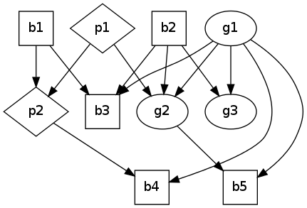
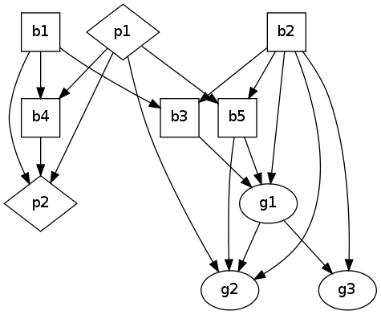

# Fit an additive Bayesian network to data

In this example, a given DAG will be fitted using abn. Take a subset of colomns from dataset `ex0.dat.data` (provided with abn):

```r
mydat <- ex0.dag.data[,c("b1","b2","b3","g1","b4","p2","p4")]
```

Setup distribution list for each node: 

```r
mydists <- list(b1="binomial",
b2="binomial", 
b3="binomial", 
g1="gaussian", 
b4="binomial",
p2="poisson", 
p4="poisson" )
```

Define a model:

```r
mydag <- matrix(data=c( 0,0,1,0,0,0,0, # b1<-b3 
1,0,0,0,0,0,0, # b2<-b1 
0,0,0,0,0,0,0, # 
0,0,0,0,1,0,0, # g1<-b4 
0,0,0,0,0,0,0, # 
0,0,0,0,0,0,0, # 
0,0,0,0,0,0,0 # 
), byrow=TRUE,ncol=7)

colnames(mydag) <- rownames(mydag) <- names(mydat)
```

Fit the model to calculate the log marginal likelihood goodness of fit:

```r
myres.c <- fitabn(dag.m=mydag,data.df=mydat,data.dists=mydists)

print(myres.c$mlik)
```

# Examine the parameter estimates

In this example, we will additionally examinate the computed marginals. Take a subset of cols from dataset `ex0.dat.data` (provided with abn)

```r
mydat <- ex0.dag.data[,c("b1","b2","b3","g1","b4","p2","p4")]
```

Setup distribution list for each node:

```r
mydists <- list(b1="binomial", 
b2="binomial", 
b3="binomial", 
g1="gaussian", 
b4="binomial", 
p2="poisson", 
p4="poisson")
```

Define a model:

```r
mydag <- matrix(data=c(
0,0,1,0,0,0,0, # b1<-b3 
1,0,0,0,0,0,0, # b2<-b1 
0,0,0,0,0,0,0, # 
0,0,0,0,1,0,0, # g1<-b4 
0,0,0,0,0,0,0, # 
0,0,0,0,0,0,0, # 
0,0,0,0,0,0,0 #
), byrow=TRUE,ncol=7)
colnames(mydag) <- rownames(mydag) <- names(mydat)
```

Now fit the model to calculate its goodness of fit:

```r
myres.c <- fitabn(dag.m=mydag,data.df=mydat,data.dists=mydists,compute.fixed=TRUE)

print(names(myres.c$marginals))
```

Gives a list of all posterior densities. Plot some of the marginal posterior densities - note that, by default, all variables are standarized. 

```r
par(mfrow=c(1,2))
plot(myres.c$marginals$b1[["b1|(Intercept)"]],type="b",xlab="b1|(Intercept)", main="Node b1, Intercept",pch="+",col="green")

plot(myres.c$marginals$g1[["g1|b4"]],type="b",xlab="g1|b4",main="Node g1, parameter b4",pch="+",col="orange")
```


# Find the best fitting graphical structure using an exact search

This dataset comes with abn see `?ex1.dag.data`:

```r
mydat <- ex1.dag.data 
```

Setup distribution list for each node:

```r
mydists <- list(b1="binomial", 
p1="poisson", 
g1="gaussian", 
b2="binomial", 
p2="poisson", 
b3="binomial", 
g2="gaussian", 
b4="binomial", 
b5="binomial", 
g3="gaussian" ) 
```

Set the parent limits nodewise:

```r
max.par <- list("b1"=4,"p1"=4,"g1"=4,"b2"=4,"p2"=4,"b3"=4,"g2"=4,"b4"=4,"b5"=4,"g3"=4)
```

Build the score cache:

```r
mycache <- buildscorecache(data.df = mydat, 
data.dists = mydists,
max.parents = max.par)
```

Find the globally best DAG. Fit the model and plot it (rquires `Rgraphviz`)

```r
mp.dag <- mostprobable(score.cache=mycache)

fitabn(dag.m=mp.dag,data.df=mydat,data.dists=mydists)$mlik; ## plot the best model - requires Rgraphviz 

myres <- fitabn(dag.m=mp.dag,data.df=mydat,data.dists=mydists,create.graph=TRUE)

plot(myres$graph)
```



# Find the best fitting graphical structure using a heuristic search

This dataset comes with abn see ?ex1.dag.data

```r
mydat <- ex1.dag.data 
```

Setup distribution list for each node 

```r
mydists <- list(b1="binomial", 
p1="poisson", 
g1="gaussian", 
b2="binomial", 
p2="poisson", 
b3="binomial", 
g2="gaussian", 
b4="binomial", 
b5="binomial", 
g3="gaussian" );
```

May take some minutes for buildscorecache() 

Set parent limits 

```r
max.par<-list("b1"=4,"p1"=4,"g1"=4,"b2"=4,"p2"=4,"b3"=4,"g2"=4,"b4"=4,"b5"=4,"g3"=4); 
```

Build cache 

```r
mycache <- buildscorecache(data.df=mydat,data.dists=mydists, dag.banned=ban, dag.retained=retain,max.parents=max.par); 
```

Repeat but this time have the majority consensus network plotted as the searches progress

```r
heur.res2 <- search.hillclimber(score.cache=mycache,num.searches=1000,seed=0,verbose=FALSE, trace=TRUE,timing.on=FALSE)
```

For publication quality output for the consensus network use graphviz

```r
tographviz(dag.m=heur.res$consensus,data.df=mydat,data.dists=mydists,outfile="graphcon.dot"); 
```

Then process using graphviz tools e.g. on linux `system("dot -Tpdf -o graphcon.pdf graphcon.dot")` and `system("evince graphcon.pdf")`. Note the .dot file created can be easily edited manually to provide custom shapes, colours etc. 

